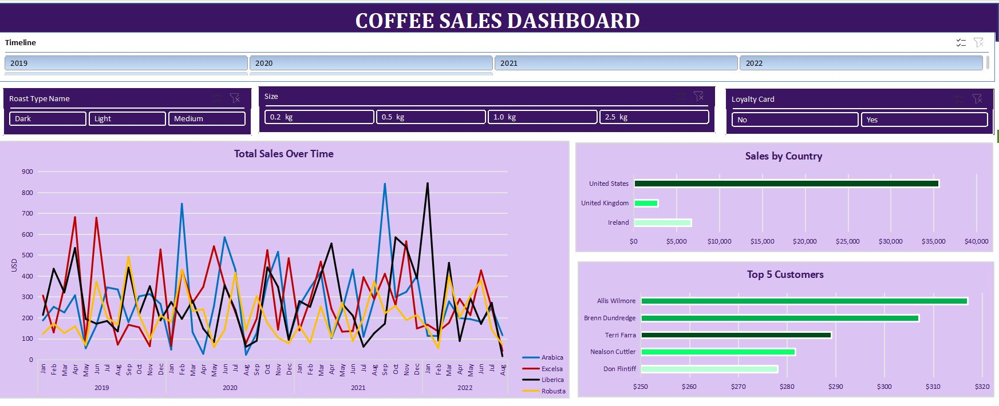

# Coffee-Sales-Excel-Data-Analysis
Data Analysis for a Coffee Sales shop, a dashboard that allows the management of the coffee shop to visualize Sales trend over time, Sales by country, Top 5 customers, with dynamic timeline and slicers for key metrics.

In this project, I used Excel functions like XLOOKUP, INDEX MATCH, and MULTIPLE IF. The dataset was cleaned, duplicates were removed, dates and numbers were accurately formatted. I used table, created pivot tables and pivot charts to visualize the data. Finally, I applied slicers, and formatted the dashboard for an interactive experience.

JJJJJJ
